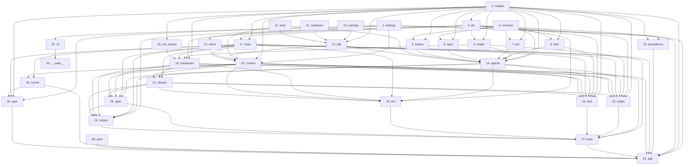

# Build Order — Assay (Python service)

The web app has its own build order in `web/BUILD_ORDER.md`.

## The problem
Bank product managers turn vague asks into delivery work by hand, so questions go unasked, answers go unrecorded, and tickets drift from what was approved. Approvers cannot trace a ticket back to a decision, and nothing checks that the work
covers what was agreed. Solved means a PM goes from an idea to an approved PRD, a spec, and a
tickets CSV with a tracker prompt, with every claim traced and every step resumable.

### What must be true for it to be solved
- **C1 Trustworthy output**: every model answer is checked against its expected shape and the rules before anything uses it. (steps 4, 10, 11, 12, 13, 14, 15, 20)
- **C2 Recorded understanding**: every answer, decision, assumption, risk, and open question is kept with who gave it, under identifiers that never change. (steps 2, 3)
- **C3 Gated progress**: no stage starts until the one before it is complete. (steps 5, 22, 27)
- **C4 Traceable documents**: the PRD, spec, and tickets trace every claim to a recorded source, in formats people and tools read. (steps 2, 7, 8, 9, 18, 19, 24, 25, 26)
- **C5 Durable sessions**: people stop and resume at will, and nothing is lost. (steps 1, 16, 17, 20, 29)
- **C6 People decide**: the right people answer, approve, and correct at every stage. (steps 1, 6, 21, 22, 23, 24, 25, 26, 28, 31, 32, 33)
- **C7 Live, standard interaction**: people see progress and pauses as they happen, through a standard agent protocol. (steps 29, 30, 31)

## How to use this skeleton
Start at step 1. In each file: read the file docstring, then build the functions in its
"Build these in order" list. For each function, read Problem piece / Why it matters / What,
work through the build steps, then un-skip its tests and make them pass. When the file's
tests pass, follow its `Next:` pointer. Once a function is implemented and tested, delete
its Build steps block; keep Problem piece, Why it matters, and What as permanent docs.

Tickets in `tickets/` set which slice to build first (task-distillation §4c): work bottom-up
*within* a ticket's slice, following this order. The acceptance suite in `tests/acceptance/`
reports each behaviour as xfail until its stubs are built, then passes.

Toolchain baseline: Python 3.14 (latest stable; 3.15.0 final is scheduled for 2026-10-09 and
was a release candidate when this skeleton was generated). Runtime dependencies are pinned
exactly (I14).
Spec ID scheme: verbatim IDs from SPECS.md (S1.1 to S9.7 for this service; S10.x are in web/).

## Sequence
| Step | Module | Capability | Builds | Depends on | Unlocks |
|---|---|---|---|---|---|
| 1 | src/assay/settings.py | C5, C6 | Hold every setting the app reads, loaded once from the environment. | — (start of project) | 15, 16, 20, 30, 31, 32 |
| 2 | src/assay/domain/models.py | C2, C4 | Define every typed shape the system passes around. | — (foundation root) | 3, 5, 6, 7, 8, 9, 13, 14, 16, 17, 18, 19, 20, 22, 23, 30, 31 |
| 3 | src/assay/domain/ids.py | C2 | Assign every identifier in the system, by code. | 2 | 5, 17, 19, 22, 23, 24, 26, 31 |
| 4 | src/assay/rules/common.py | C1 | Hold the text rules several agents share. | — (foundation root) | 6, 7, 8, 9, 14 |
| 5 | src/assay/rules/intake.py | C3 | Check intake entries and decide whether intake is complete. | 2, 3 | 14, 19, 22 |
| 6 | src/assay/rules/dod.py | C6 | Check Definition of Done items and the team standard. | 2, 4 | 14, 23 |
| 7 | src/assay/rules/prd.py | C4 | Check the PRD's stories, features, requirements, and narrative. | 2, 4 | 14 |
| 8 | src/assay/rules/spec.py | C4 | Check that the spec covers exactly the PRD's requirements. | 2, 4 | 14 |
| 9 | src/assay/rules/tickets.py | C4 | Check a ticket plan. | 2, 4 | 14 |
| 10 | src/assay/llm/caching.py | C1 | Build cache-friendly messages and read token usage. | — (foundation root) | 13 |
| 11 | src/assay/llm/resilience.py | C1 | Retry transient gateway errors with exponential backoff and jitter. | — (foundation root) | 13 |
| 12 | src/assay/llm/tools.py | C1 | Give agents read-only, sandboxed access to allowlisted code. | — (foundation root) | 13, 14, 20 |
| 13 | src/assay/llm/call.py | C1 | Get typed, rule-checked output from any tool-calling model. | 2, 10, 11, 12 | 14, 20 |
| 14 | src/assay/llm/agents.py | C1 | Define every agent from its prompt files, output shape, and rules. | 2, 4, 5, 6, 7, 8, 9, 12, 13 | 22, 23, 24, 25, 26 |
| 15 | src/assay/llm/client.py | C1 | Create the chat client for one model on the bank's gateway. | 1 | 20 |
| 16 | src/assay/store/persistence.py | C5 | Open the checkpoint saver and the shared store. | 1, 2 | 31 |
| 17 | src/assay/graph/state.py | C5 | Define the session state that is checkpointed after every step. | 2, 3 | 19, 20, 21, 22, 23, 24, 25, 26, 27, 29, 30, 31 |
| 18 | src/assay/render/csv_export.py | C4 | Write the tickets CSV: each story, then each feature followed by its tickets. | 2 | 19 |
| 19 | src/assay/render/markdown.py | C4 | Write every markdown artifact, and the PDF and prompt, from typed state. | 2, 3, 5, 17, 18 | 21, 22, 23, 24, 25, 26 |
| 20 | src/assay/graph/context.py | C1, C5 | Hold run-time dependencies that LangGraph injects into every node. | 1, 2, 12, 13, 15, 17 | 21, 22, 23, 24, 25, 26, 27, 29, 31 |
| 21 | src/assay/graph/nodes/shared.py | C6 | Hold helpers several workflow stages use. | 17, 19, 20 | 22, 23, 24, 25, 26 |
| 22 | src/assay/graph/nodes/intake.py | C3, C6 | Run intake: setup, the three modes, the grill loop, and the intake gate. | 2, 3, 5, 14, 17, 19, 20, 21 | 27 |
| 23 | src/assay/graph/nodes/dod.py | C6 | Agree the team Definition of Done once, then initiative additions. | 2, 3, 6, 14, 17, 19, 20, 21 | 27 |
| 24 | src/assay/graph/nodes/prd.py | C4, C6 | Write the PRD, render it, and get sign-off from a named approver. | 3, 14, 17, 19, 20, 21 | 27 |
| 25 | src/assay/graph/nodes/spec.py | C4, C6 | Agree test seams with developers, then write the spec. | 14, 17, 19, 20, 21 | 26, 27 |
| 26 | src/assay/graph/nodes/tickets.py | C4, C6 | Cut tickets, have a person review them, then export the CSV and prompt. | 3, 14, 17, 19, 20, 21, 25 | 27 |
| 27 | src/assay/graph/build.py | C3 | Wire every node and edge of the workflow. | 17, 20, 22, 23, 24, 25, 26 | 31 |
| 28 | src/assay/api/auth.py | C6 | Read the signed-in user from the SSO proxy's header. | — (foundation root) | 31 |
| 29 | src/assay/api/runner.py | C5, C7 | Run sessions in the background and publish their progress. | 17, 20 | 30, 31 |
| 30 | src/assay/api/agui.py | C7 | Serve Assay over AG-UI: runs as events, pauses as standard interrupts. | 1, 2, 17, 29 | 31 |
| 31 | src/assay/api/app.py | C6, C7 | Serve the REST API and the AG-UI endpoint. | 1, 2, 3, 16, 17, 20, 27, 28, 29, 30 | — |
| 32 | src/assay/cli.py | C6 | Provide the command line: serve the app and report build progress. | 1 | 33 |
| 33 | src/assay/__main__.py | C6 | Run the command line with 'python -m assay'. | 32 | — |

Package markers (`__init__.py`) share their package's first step. `src/assay/vendor/` holds the
vendored PDF renderer (D15) and is outside the build order.

## Dependency graph

## Assumptions
- A1: the model gateway is OpenAI-compatible with tool calling; only `assay.llm.client` changes if not.
- A2: the gateway passes prompt-cache markers through; check the usage endpoint's cache-hit rate.
- A3: one web worker carries pilot load; session locks live in memory.
- A4: the SSO proxy sets a trusted user header on every request to the Next.js service.
- Python 3.14 baseline; PEP 695 syntax is used, and no `from __future__` imports.
- Runtime dependencies are pinned exactly, overriding spec-skeleton's lower-bound default, per I14.
- The PDF renderer, prompts, and templates ship complete (D15); everything else is a stub (D14).

## Open questions
- OQ-1 (S9.3, src/assay/api/agui.py resume_value): what a 'cancelled' resume entry should do to an Assay session.
